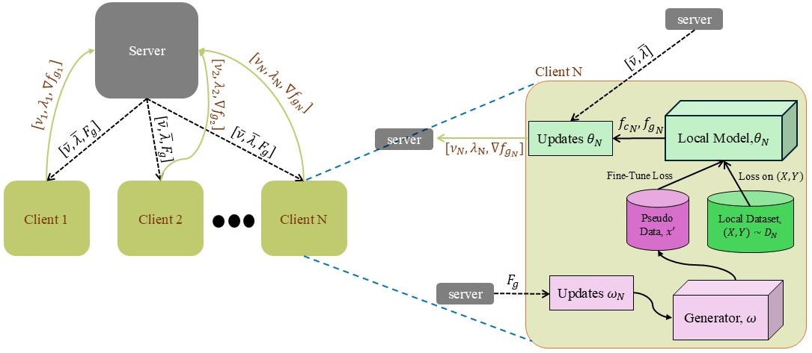

# README

## Overview

This repository contains the implementation code for the paper titled **"Enhancing Privacy-Preserving of Heterogeneous Federated Learning Algorithms Using Data-Free Knowledge Distillation"**. The proposed FedSGAN architecture is illustrated in the figure below:



The implementation is developed in Python and is designed to work with the CIFAR-10 and MNIST datasets.

## How to Run

To run the implementation, execute the `main.py` script. This script is the entry point for the code and will initiate the federated learning process with the FedSGAN architecture.

```bash
python main.py
```

## How to Change the Model Architecture

To modify the model architecture used by the clients:

1. Update the model definition in the `net.py` file located in the `model` folder.
2. Refer to `main.py` for configuration details such as communication rounds and other settings that might need adjustment based on the new model architecture.

## Additional Information

For further details on configuration and usage, please refer to the comments and documentation within the `main.py` and `net.py` files. If you have any questions or need support, feel free to open an issue on this repository.

Happy coding!